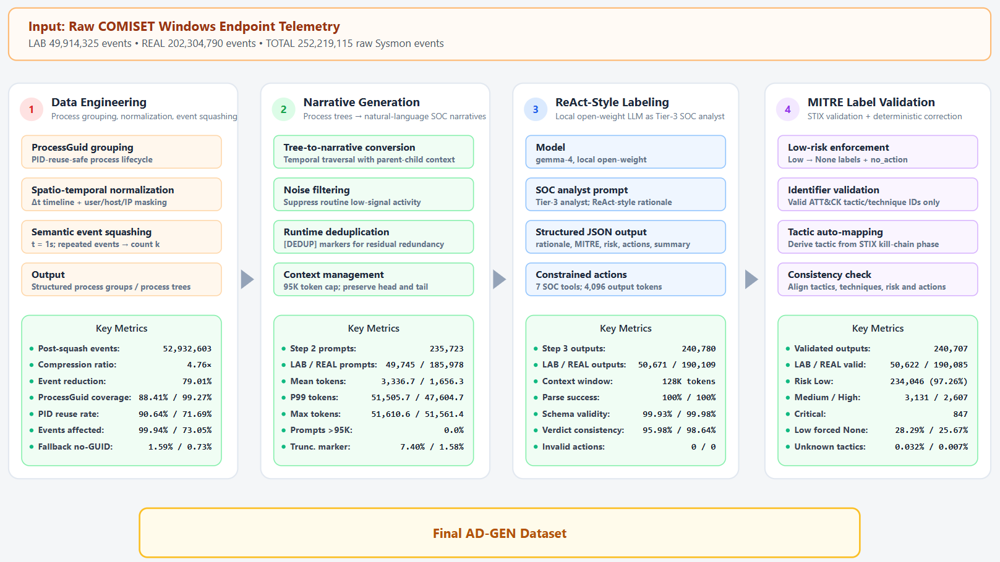

# AD-GEN: Evidence-Preserving Generation of Validated ATT&CK-Aligned Narratives from Large-Scale Endpoint Telemetry

<p align="center">
  
</p>

<p align="center">
  <b>LLM-Ready Endpoint Security Dataset for SOC Automation, ATT&CK Reasoning, and Instruction Tuning</b>
</p>

---

# Overview

AD-GEN is a large-scale endpoint telemetry transformation pipeline and dataset designed for:

- LLM-based SOC automation
- MITRE ATT&CK-aware instruction tuning
- Threat hunting assistant development
- Endpoint behavior reasoning
- Security narrative generation

AD-GEN transforms raw Windows Sysmon telemetry into:

- process-centric narratives,
- privacy-preserving representations,
- compressed behavioral sequences,
- and validated ATT&CK-aligned synthetic analyst labels.

The dataset is generated from the COMISET Windows endpoint telemetry corpus.

---

# Pipeline

AD-GEN transforms raw Windows endpoint telemetry into process-centric, privacy-preserving, compressed, and ATT&CK-aligned narrative records.

The pipeline performs:

- process-lifecycle reconstruction,
- spatio-temporal normalization,
- semantic compression,
- SOC-style narrative generation,
- ReAct-style automated labeling,
- and deterministic MITRE ATT&CK validation.

The complete pipeline is illustrated above.

---

# Dataset Scale

AD-GEN is generated from large-scale Windows endpoint telemetry across both laboratory and real-world enterprise environments.

| Metric | LAB | REAL | Total |
|---|---:|---:|---:|
| Raw Sysmon events | 49,914,325 | 202,304,790 | 252,219,115 |
| Post-squash events | 21,360,985 | 31,571,618 | 52,932,603 |
| Step 2 prompts | 49,745 | 185,978 | 235,723 |
| Step 3 LLM outputs | 50,671 | 190,109 | 240,780 |
| Step 4 validated outputs | 50,622 | 190,085 | 240,707 |

---

# Compression Statistics

| Environment | Raw Events | Post-Squash Events | Compression Ratio | Event Reduction |
|---|---:|---:|---:|---:|
| LAB | 49,914,325 | 21,360,985 | 2.34× | 57.20% |
| REAL | 202,304,790 | 31,571,618 | 6.41× | 84.39% |
| Overall | 252,219,115 | 52,932,603 | 4.76× | 79.01% |

---

# Risk Distribution

| Risk Level | Count | Percentage |
|---|---:|---:|
| Low | 234,046 | 97.26% |
| Medium | 3,131 | 1.30% |
| High | 2,607 | 1.08% |
| Critical | 847 | 0.35% |

---

# MITRE ATT&CK Distribution

| Tactic ID | Tactic Name | Frequency |
|---|---|---:|
| TA0004 | Privilege Escalation | 3,157 |
| TA0005 | Defense Evasion | 2,511 |
| TA0003 | Persistence | 2,451 |
| TA0002 | Execution | 1,763 |
| TA0007 | Discovery | 727 |
| TA0006 | Credential Access | 603 |

---

# Output Format

Each AD-GEN record is represented as structured JSON.

```json
{
  "thought_process": "Behavioral reasoning summary.",
  "mitre_tactics": [
    "TA0006_Credential_Access"
  ],
  "mitre_techniques": [
    "T1003.001_OS_Credential_Dumping_LSASS_Memory"
  ],
  "risk_level": "Critical",
  "recommended_actions": [
    {
      "tool_name": "terminate_process",
      "parameters": {},
      "rationale": "Credential dumping behavior detected."
    }
  ],
  "summary": "Suspicious LSASS memory access consistent with credential dumping."
}
```

---

# Supported SOC Actions

AD-GEN constrains action generation to a fixed SOC vocabulary.

```text
check_threat_intel
get_file_metadata
query_registry
get_network_flow
terminate_process
isolate_host
no_action
```

---

# Label Quality

| Metric | LAB | REAL |
|---|---:|---:|
| Parse success | 100.00% | 100.00% |
| Schema validity | 99.93% | 99.98% |
| Verdict consistency | 95.98% | 98.64% |
| Unknown tactics after validation | 0.032% | 0.007% |
| Unknown techniques after validation | 0.041% | 0.013% |
| Invalid actions | 0 | 0 |

---

# Repository Structure

```text
AD-GEN/
├── REAL
├── LAB
└── README.md
```

---

# Installation

```bash
git clone https://github.com/namhop88/AD-GEN.git
cd AD-GEN
```
---

# Important Note

AD-GEN labels are:

> validated synthetic analyst labels

They are **not human-adjudicated forensic ground truth**.

The dataset is intended for:

- instruction tuning,
- weakly supervised learning,
- SOC assistant development,
- ATT&CK-aware reasoning,
- and large-scale endpoint narrative modeling.

Additional expert review is recommended for operational deployment.

---

# Citation

```bibtex
@article{nam2026adgen,
  title   = {AD-GEN: Evidence-Preserving Generation of Validated ATT\&CK-Aligned Narratives from Large-Scale Endpoint Telemetry},
  author  = {Dinh Phuong Nam and Nguyen Tan Cam},
  year    = {2026},
  journal = {Preprint}
}
```

---

# License

Recommended:

- Code: MIT License
- Dataset: CC BY-NC 4.0

---

# Disclaimer

AD-GEN is released for academic and defensive cybersecurity research only.

The dataset should not be used as the sole basis for operational security decisions without expert review.

---

# Contact

**Dinh Phuong Nam**  
University of Information Technology — VNU-HCM

HUTECH UNIVERSITY

GitHub:
```text
@tydinh888
```